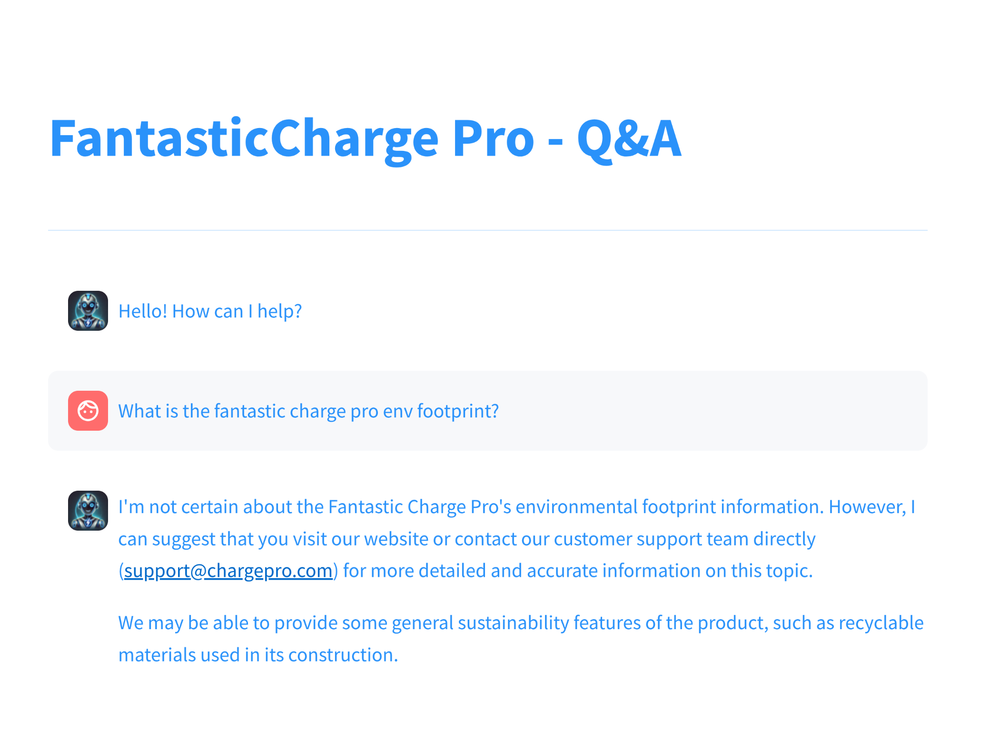

# Instructions

## Starting the chatbot

```
# Download QA data in txt format under some path eg. data/fantastic_charge
# Save in a file named qa.txt.

Disclaimer: The sample data in this repo are generated automatically by an LLM for a fictional product and meant to have no relation with an existing product. Any resemblance is purely coincidental.

# Install Ollama and pull the models
ollama pull llama3:instruct
olllama pull mxbai-embed-large

# Ingest txt Q&A data in Chroma DB
uv run src/data/qa_ingest.py ./data/fantastic_charge/qa.txt /tmp/ch_db

# start opik as shown in the next section

# Run the Chat Streamlit app
source .venv/bin/activate

python -m streamlit run ./src/qa/qa_st.py

# Alternatively:

uv run python -m streamlit run ./src/qa/qa_st.py
```

### Running opik.

Follow the instructions in https://www.comet.com/docs/opik/self-host/local_deployment.
The chatbot app is configured to bypass opik url input and work with opik running locally.


## Building the images

To build the images:

```
docker build -t skonto/ollama:qa -f Dockerfile.ollama .

docker build --no-cache  --progress=plain --secret "id=guard,src=$HOME/.guardrailsrc" . -t skonto/qa
```

To run the images:

```
docker run --gpus all -p8080:11434 skonto/ollama:qa

docker run -it --gpus all -e OLLAMA_HOST=localhost:8080 --net=host skonto/qa
```

Access the app at: http://localhost:8501

## Interacting with the Q&A Assistant





