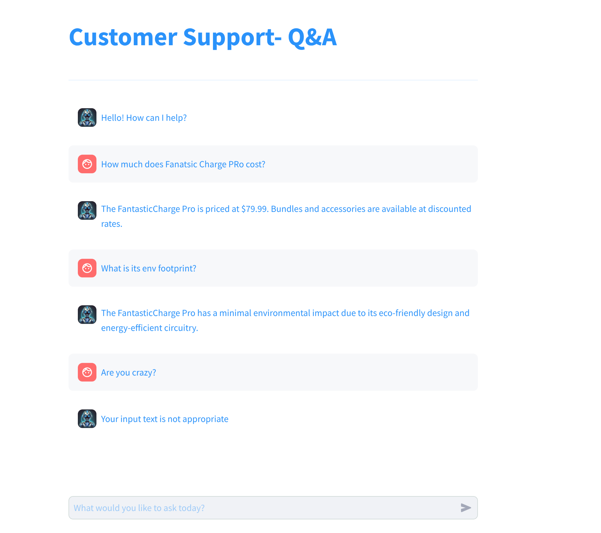

# AI‑Systems 🚀
Sample agentic AI projects & reference implementations — Retrieval-Augmented Generation (RAG), LangChain agents, evaluation pipelines, and more

## 📑 Contents

- [Quickstart](#-quickstart)
- [Architecture](#-architecture)
- [Components](#-components)
- [Evaluation](#-evaluation)
- [Contributing](#-contributing)
- [License](#-license)

## Quickstart

```
# Download QA data in txt format under some path eg. data/fantastic_charge
# Save in a file named <filename>.txt.

Disclaimer: The sample data in this repo are generated automatically by an LLM for a fictional product and meant to have no relation with an existing product. Any resemblance is purely coincidental.

# Install Ollama and pull the models
ollama pull llama3:8b-instruct-q4_0
olllama pull BGE-M3:latest

# start opik as shown in the next section

uv sync --dev

# Ingest txt Q&A data in Chroma DB
uv run src/data/rag_ingest.py ./data/products /tmp/ch_db

# Run the Chat Streamlit app
uv run python -m streamlit run ./src/chatbot/app.py

# or
source .venv/bin/activate
python -m streamlit run ./src/chatbot/app.py
```

### Running opik.

Follow the instructions in https://www.comet.com/docs/opik/self-host/local_deployment.
The chatbot app is configured to bypass opik url input and work with opik running locally.


### Interacting with the Q&A Assistant




### Building the images

To build the images:

```
docker build -t skonto/ollama:qa -f Dockerfile.ollama .

docker build --no-cache  --progress=plain --secret "id=guard,src=$HOME/.guardrailsrc" . -t skonto/qa
```

To run the images:

```
docker run --gpus all -p8080:11434 skonto/ollama:qa

docker run -it --gpus all -e OLLAMA_HOST=localhost:8080 --net=host skonto/qa
```

Access the app at: http://localhost:8501


## 🧠 Architecture

The system consists of:
- Document ingestion and embedding
- RAG pipeline using Ollama
- Chatbot (CLI/HTTP interface)
- Evaluation using RAGAS and custom metrics


## 📦 Components

- `src/data/`: Document ingestion & indexing
- `src/rag/`: RAG pipelines using Ollama
- `src/chatbot/`: CLI/HTTP chatbot interfaces
- `src/test/`: Unit + integration tests and benchmarks
- `Makefile`, `uv`: commands for lint, test, format, eval

## 📈 Evaluation

Evaluate generated answers using [RAGAS](https://github.com/explodinggradients/ragas):

```bash
uv run pytest -m integration
```

Metrics include:
- `LLMContextRecall`
- `FactualCorrectness`
- `BleuScore`
- `ResponseRelevancy`

## 🤝 Contributing

Contributions welcome!

1. Fork and clone
2. Run `uv sync --dev`
3. Lint: `make lint`
4. Type-check: `make type-check`
5. Test: `pytest`

## 📄 License

This repository is licensed under the Apache 2 License — see [LICENSE](LICENSE) for full details.
