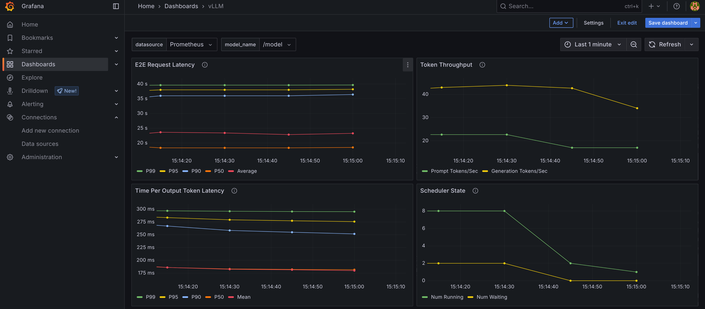
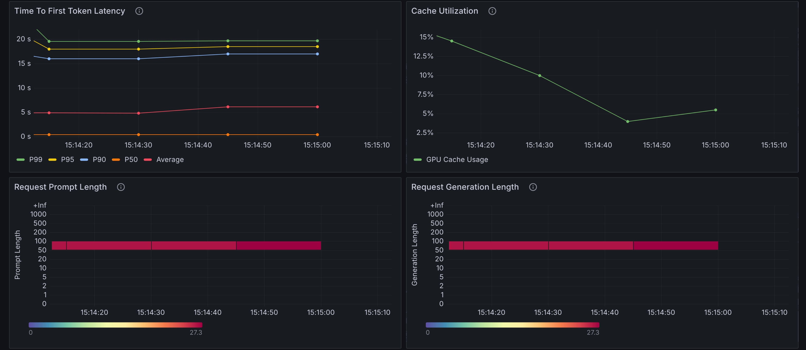
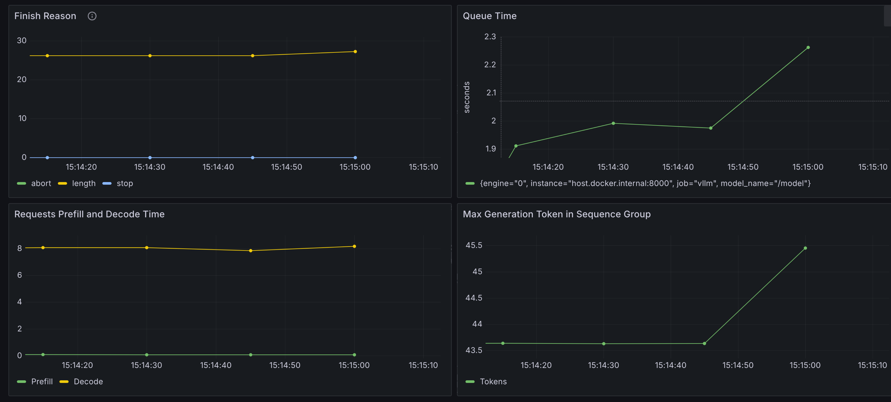

# Deploying Llama localy with vLLM.

Download the files from https://huggingface.co/unsloth/Meta-Llama-3.1-8B-Instruct-bnb-4bit/tree/main in a local folder.
Note that if you want to test vLLM with a small model you can try `facebook/opt-125m`.

```
# Build the vLLM server with bnb support. We could derive directly from the official vLLM image but this is more controlled.
docker build -t vllm-server .

# Run it locally
docker run --runtime nvidia -v $(pwd)/local-model:/model --gpus all -p 8000:8000 vllm-server /model --max-model-len 1024 --gpu-memory-utilization 0.8 --max-num-seqs 8

# Grab the vLLM id. vLLM supports one model anyway.
curl -X GET http://localhost:8000/v1/models
{"object":"list","data":[{"id":"/model","object":"model","created":1751441887,"owned_by":"vllm","root":"/model","parent":null,"max_model_len":1024,"permission":[{"id":"modelperm-8e40ed8ee270417f8177fa93ff12c2fb","object":"model_permission","created":1751441887,"allow_create_engine":false,"allow_sampling":true,"allow_logprobs":true,"allow_search_indices":false,"allow_view":true,"allow_fine_tuning":false,"organization":"*","group":null,"is_blocking":false}]}]}


# Ask something
curl http://localhost:8000/v1/chat/completions -H "Content-Type: application/json"   -d '{
    "model": "/model",
    "messages": [
      {"role": "user", "content": "What do you know about the capital of Greece? Summarize in a paragraph."}
    ],
    "max_tokens": 100,
    "temperature": 0.0
  }'

{"id":"chatcmpl-3bf71c905137415cb3b052b54ecc77f9","object":"chat.completion","created":1751441693,"model":"/model","choices":[{"index":0,"message":{"role":"assistant","reasoning_content":null,"content":"The capital of Greece is Athens (Greek: Αθήνα, Athína). Located in the Attica region, Athens is a historic city with a rich cultural heritage. It is situated on the Saronic Gulf, approximately 10 kilometers (6.2 miles) from the Aegean Sea. The city is home to numerous iconic landmarks, including the Parthenon, a UNESCO World Heritage Site and one of the most famous ancient Greek monuments, the Acropolis, a citadel that sits atop a","tool_calls":[]},"logprobs":null,"finish_reason":"length","stop_reason":null}],"usage":{"prompt_tokens":52,"total_tokens":152,"completion_tokens":100,"prompt_tokens_details":null},"prompt_logprobs":null,"kv_transfer_params":null}
```

This is running on a 8GB card.

Things to watch out for:

- vLLM initially loads the model weights (~5.5GB) and then does a torch.compile that opimizes the graph that takes several seconds but also increases memory.

- vLLM will build the KV Cache next. KV Cache requires extra space depending on `max-model-len`. You can control that with `gpu-memory-utilization` but you need to make sure memory is available when warm up is done (see next).

- vLLM will issue by default 256 requests in a parallel warm up session (warm up kernels etc). If `max-num-seqs` is too high (default is 256) then a lot of memory blocks will be allocated.

Idle mode footprint:

```
Wed Jul  2 10:43:05 2025
+-----------------------------------------------------------------------------------------+
| NVIDIA-SMI 570.144                Driver Version: 570.144        CUDA Version: 12.8     |
|-----------------------------------------+------------------------+----------------------+
| GPU  Name                 Persistence-M | Bus-Id          Disp.A | Volatile Uncorr. ECC |
| Fan  Temp   Perf          Pwr:Usage/Cap |           Memory-Usage | GPU-Util  Compute M. |
|                                         |                        |               MIG M. |
|=========================================+========================+======================|
|   0  NVIDIA GeForce RTX 4060 ...    Off |   00000000:01:00.0  On |                  N/A |
| N/A   42C    P5              6W /   70W |    7545MiB /   8188MiB |      0%      Default |
|                                         |                        |                  N/A |
+-----------------------------------------+------------------------+----------------------+
                                                                                         
+-----------------------------------------------------------------------------------------+
| Processes:                                                                              |
|  GPU   GI   CI              PID   Type   Process name                        GPU Memory |
|        ID   ID                                                               Usage      |
|=========================================================================================|
|    0   N/A  N/A            2924      G   /usr/bin/gnome-shell                    130MiB |
|    0   N/A  N/A          309151      C   /usr/bin/python3                       7364MiB |

```


# Monitoring 

vLLM exposes several metrics (see https://docs.vllm.ai/en/v0.7.0/serving/metrics.html).
There is also a Grafana dashboard that can be used with Prometheus (https://docs.vllm.ai/en/v0.7.3/getting_started/examples/prometheus_grafana.html).
Using the load test script we run the same query multipel times:


python vllm-load.py 
Running load test with 10 users and 50 total requests...

✅ Success: 50
❌ Failed: 0
📊 Avg Latency: 23.26 seconds

The Grafana reported metrics are shown next:





